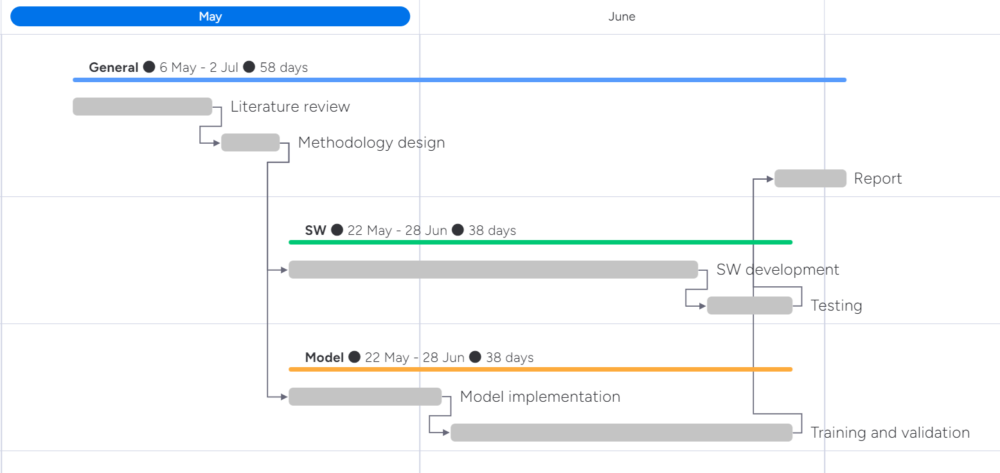

# Practical Proposal: Breast Cancer Immunohistochemical Image Generation

**Group Member**

Xichu Yu

Maiqi Zhou

Yuchen Li

## Introduction

Breast cancer continues to be a prominent cause of global female mortality. Efficacious treatment plans and precise diagnoses pivot critically on the comprehensive evaluation of histopathological images, specifically, Hematoxylin and Eosin (HE) and Immunohistochemistry (IHC) stained slices, as is shown in Figure 1. [1]

Nevertheless, there exist specific constraints when evaluating the degree of HER2 expression through IHC technology. The process of preparing IHC-stained sections is costly. Tumors demonstrate heterogeneity, yet IHC staining typically occurs on a single pathological section in clinical settings, potentially inadequately representing the tumor's condition [1].

In order to enhance breast cancer diagnosis, we propose to train a deep-learning model, capable of image-to-image translation between HE domain and IHC domain. Subsequently, we aim to develop user-friendly software leveraging this model, facilitating seamless integration into clinical practice.

## Related Work

Broad research advancements in the realm of breast cancer diagnostics have harnessed the utility of Hematoxylin and Eosin (HE) and Immunohistochemistry (IHC) stained images. Zhu et al. summarized the participant models in [2] and presented further analysis for each model.

Team arptidec5 leveraged Pyramid Pix2pix model, which is a type of conditional generative adversarial network (GAN). They extended the Pix2Pix framework by introducing a hierarchical architecture to improve the quality and fidelity of image translation tasks. The organizers of the challenge firstly applied this model to BCI analysis in one of their previous work [3].

Team Just4Fun's solution was constructed utilizing the architecture of GAN. They employed an encoder derived from BCIStainer to extract features from HE images for classification purposes. The classification outcome serves as guidance for the generator within the framework.

Team lifangda02 implemented the resnet-9-blocks generator in their solution, incorporating an innovative paired InfoNCE contrastive loss, which extends the InfoNCE loss. In this approach, an output patch serves as the query, with the corresponding Immunohistochemistry (IHC)-stained patch designated as the positive sample, while non-corresponding patches are designated as negatives.

Team stan9 used a weakly supervised deep generative network called WeCREST. Their method involves a multi-class discriminator to distinguish between real and synthetic image styles, and incorporates a classifier that operates on the discriminator to sort images based on the HER2 expression status, labeled according to the corresponding IHC stained images.

Team vived23 employed conditional generative adversarial network (cGAN) based on the paired images. They applied the discrete wavelet transform to extract 4 chennels of spitial and frequency domain features from HE images.

## Dataset

The official Breast Cancer Immunohistochemical (BCI) dataset for this challenge is presented in [2]. The BCI dataset provides a pool of 9,746 images (4,873 pairs), partitioned into 3,896 training pairs and 977 testing pairs. This diverse collection captures various HER2 expression levels, ensuring adaptability and broad applicability of our model in breast cancer diagnostics.

## Objectives

We propose our project objectives in following two aspects:

+ Software engineering:
  - User-friendly graphical user interface (GUI).
  - Requirement engineering (e.g. Support environments without (a powerful) GPU).
  - Good usability in software testing.
+ Model:
  + Implementation of valid model(s).
  + High scores in evaluation with benchmark provided officially in [2].

## Proposed activities

### Timeline

| Task                    | Date          |
| ----------------------- | ------------- |
| Literature review       | 6-16 May      |
| Methodology design      | 17-21 May     |
| Model implementation    | 22 May-2 Jun  |
| Training and validation | 3-28 Jun      |
| Software development    | 22 May-21 Jun |
| Testing                 | 22-28 Jun     |
| Report                  | 27 Jun-2 Jul  |

The Gantt chart below shows the proposed workflow of our team.

## Reference

[1] "Breast Cancer Immunohistochemical Image Generation Challenge." grand-challenge.org. https://bci.grand-challenge.org/ (accessed May. 1, 2024)

[2] Zhu et al. "Breast Cancer Immunohistochemical Image Generation: a Benchmark Dataset and Challenge Review." *arXiv preprint arXiv:2305.03546* (2023).

[3] Liu et al. "Bci: Breast cancer immunohistochemical image generation through pyramid pix2pix." In *Proceedings of the IEEE/CVF conference on computer vision and pattern recognition*, pp. 1815-1824. 2022.
